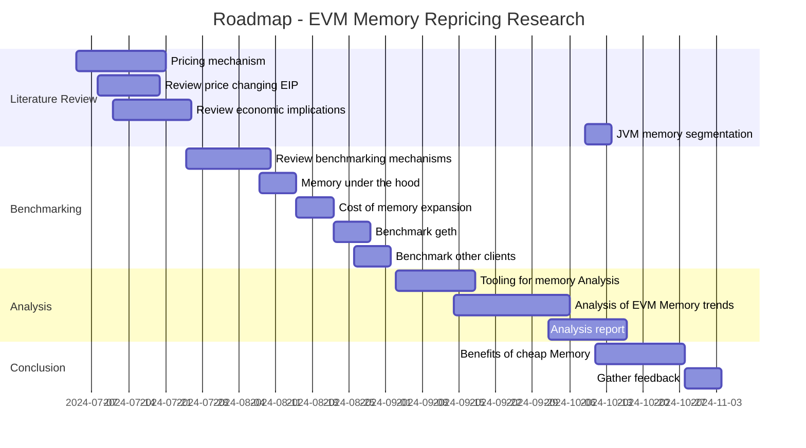

# EVM memory repricing

## Motivation

Memory is a critical resource that enables complex computations within the Ethereum Virtual Machine (EVM). The cost of using memory, designed to prevent its abuse, has not been revised since the inception of Ethereum. However, efficiency gains from hardware advancements and client code optimizations warrants periodic repricing of this cost. By revising the pricing structure, it may be possible to reduce the costs associated with memory-intensive operations in the EVM, thereby making previously prohibitively expensive applications feasible.

## Project description

The EVM's memory is a **word-addressed byte array** that stores its **volatile state**. Accessing memory, like any instruction in the EVM, incurs fees in a unit called **gas**.

Gas does not measure the direct cost of execution, but rather the _computational effort_ required by a node's hardware to execute EVM instructions. Transactors pay for per unit of gas at market value which ultimately determines the execution cost.

This project focuses on analyzing the gas costs associated with accessing EVM Memory.

## Roadmap

## Possible challenges

Gas metering is an open problem in Ethereum given the spectrum of underlying hardware and software. It will be challenging to come up with a reliable analysis.

Moreover, Ethereum has several software implementations and runs on a spectrum of hardware ranging from server to consumer grade. To reliably price a resource for the network as a whole remains an open problem. It must also be noted that under pricing of resources opens up potential denial-of-service attack vectors.

## Goal of the project

The goal of the project is provide data points to support repricing of memory usage in the EVM.

## Collaborators

### Fellows

- @raxhvl

### Mentors

- @chfast

## Acknowledgments

Thanks to [Mário Havel](https://github.com/taxmeifyoucan/) for providing access to the archive node for analysis, [Jacek Glen](https://github.com/JacekGlen) for his review of the benchmarks, [Daniel](https://github.com/ekpyron) for his inputs on paged memory, and [Vitalik](https://github.com/vbuterin) for his feedback.

## Resources

- 📄 Gavin W., [Ethereum Yellow Paper](https://ethereum.github.io/yellowpaper/paper.pdf)
- 📄 EPF Wiki, [EVM](https://epf.wiki/#/wiki/EL/evm)
- 📄 Eth Research, [On Block Sizes, Gas Limits and Scalability](https://ethresear.ch/t/on-block-sizes-gas-limits-and-scalability/18444)
- 📄 John A., [Wait, It's All Resource Pricing?](https://www.youtube.com/watch?v=YoWMLoeQGeI)
- 📄 John A., [Induced Demand from Blockchain Resource Pricing](https://www.youtube.com/watch?v=_6ctMrlhcO4)
- 📄 Martin H., [Gas benchmarks](https://github.com/ethereum/benchmarking/blob/master/constantinople/analysis2.md)
- 📜 Ipsilon, [EVM benchmarks](https://github.com/ipsilon/evm-benchmarks)
- 📄 Ethereum Research, [Gas Price Table](https://ethresear.ch/t/gas-price-table/67)
- 📄 Ipsilon et al., [EVM384 Update 5: First Gas Cost Estimates](https://notes.ethereum.org/@poemm/evm384-update5#Memory-Manipulation-Cost)
- 📜 Geth, [Protocol Params](https://github.com/ethereum/go-ethereum/blob/master/params/protocol_params.go)
- 📄 Eth Research,[EIP-1380: Reduced gas cost for call to self](https://ethereum-magicians.org/t/eip-1380-reduced-gas-cost-for-call-to-self/1242)
- 📄 Michael K., [A Scalable Method to Analyze Gas Costs, Loops and Related Security Vulnerabilities on the Ethereum Virtual Machine](https://raw.githubusercontent.com/wiki/usyd-blockchain/vandal/pubs/MKong17.pdf)
