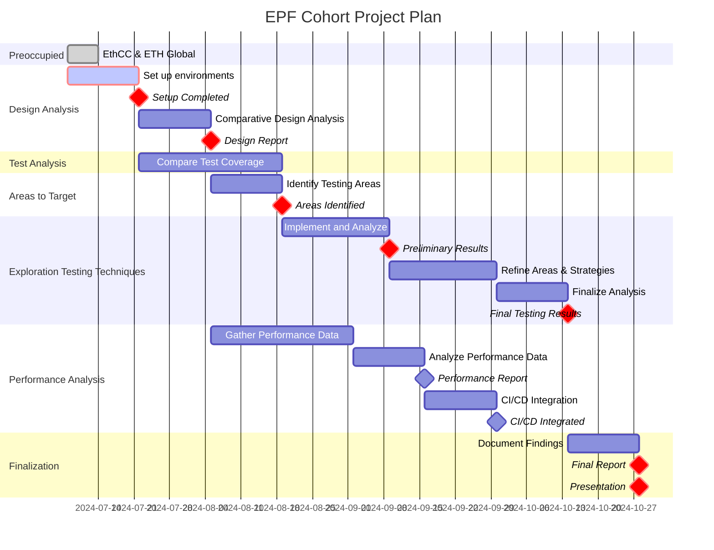

# Securing Grandine's Performance

Parallel Paths: Journey to Peak Performance.

## Motivation

What problem is your project is solving? Why is it important and what area of the protocol will be affected?

The Grandine client aims to deliver high performance and simplicity through parallelization and efficient design. However, to ensure its robustness and security, there is a need for thorough testing and performance profiling. This project will address these needs, aiming to enhance the reliability and efficiency of Grandine, thereby contributing to the stability and performance of the Ethereum network.

## Project description

What is your proposed solution?

1. Conduct a comparative analysis between Grandine and Lighthouse to identify architectural differences, dependencies, and key optimizations as a foundational step towards advanced testing.
2. Set up and run both clients to establish baseline performance metrics and understand their behavior in a live environment, consolidating this process with the testing infrastructure setup.
3. Evaluate the current testing infrastructure, focusing on existing client-independent spec-tests and the end-to-end testing framework Hive to identify gaps.
4. Utilize existing repositories for performance profiling and integrate these tools into CI/CD pipelines to ensure continuous performance monitoring.
5. Explore and evaluate advanced testing techniques such as property-based testing, sanitizers, and concurrency testing tools to determine their feasibility and effectiveness.
6. Implement the most promising testing methods to uncover and address vulnerabilities, particularly those related to parallelization.

## Specification

How will you implement your solutions? Give details and more technical information on the project.

### Comparative Analysis of CL Clients
- Create a brief overview of existing CL clients.
- Focusing on Grandine and Lighthouse, obtain a high-level overview of their designs and compare them.
- Review the codebases to identify major optimizations, particularly related to parallelization.

### Comparative Analysis of CL Clients
- Create an overview of existing CL clients to understand the landscape.
- Obtain a high-level overview of the designs of Grandine and Lighthouse, focusing on their architectural differences.
- Review the codebases to identify key optimizations, particularly related to parallelization, to guide the selection of modules of interest for advanced testing methods.

### Running Clients and Testing Infrastructure
- Set up controlled environments for both Grandine and Lighthouse to ensure consistent testing conditions.
- Run both clients, gather performance data using tools like the [profiling](https://github.com/aclysma/profiling) crate, and document initial observations and metrics.
- Compare the test coverage between Grandine and Lighthouse.
	- Investigate the client-independent tests (i.e. [consensus-spec-tests](https://github.com/ethereum/consensus-spec-tests)).
	- Explore [Hive](https://github.com/ethereum/hive) e2e testing frameworks.

### Performance Profiling and Monitoring
- Use the [existing repository](https://github.com/migalabs/eth-client-hw-analysis) for performance profiling and analysis.
- Assess the feasibility of integrating performance monitoring into the CI/CD pipeline.

### Exploring and Integrating Fuzzers / Sanitizers
- Explore various advanced testing strategies:
  - **Property-based Testing**: Using [proptest](https://github.com/proptest-rs/proptest) to generate arbitrary inputs and test code properties.
  - **Sanitizers**: Utilize tools described in the [Rust Unstable Book on Sanitizers](https://doc.rust-lang.org/beta/unstable-book/compiler-flags/sanitizer.html) to detect issues like memory leaks, data races, etc.
  - **Concurrency Testing**: Using [Loom](https://github.com/tokio-rs/loom) for permutation testing to find concurrency issues.
- Implement the most promising of these methods to detect concurrency issues or other hidden vulnerabilities.

## Roadmap

What is your proposed timeline? Outline parts of the project and insight on how much time it will take to execute them.

## Possible challenges

What are the limitations and issues you may need to overcome?

1. **Resource Constraints**: Limited time will restrict the depth of analysis and the extent to which advanced testing strategies can be implemented and evaluated.
2. **Complexity of Comparative Analysis**: Understanding and comparing the architectural differences between Grandine and Lighthouse may be challenging due to design complexity and a lack of documentation.
3. **Setup and Environment Configuration**: Setting up and running both clients in a controlled environment may require troubleshooting.
4. **Performance Profiling Integration**: Integrating performance profiling tools into the CI/CD pipeline could present compatibility and configuration issues.
5. **Testing Tool Adaptation**: Adapting property-based testing, sanitizers, and concurrency testing tools to the specific context of the Grandine client may require substantial customization and experimentation.
6. **Identifying Critical Components**: Determining which components of Grandine are likely to be most susceptible to vulnerabilities, and therefore should be the focus of testing, may not be apparent.

## Goal of the project

What does success look like? Describe the end goal of the project, scope, state and impact for the project to be considered finished and successful.

Success for this project will be defined by:
* A detailed comparative report between Grandine and Lighthouse.
* Established baseline performance metrics for both clients.
* Enhanced test coverage and recommendations for Grandine.
* Integration or recommendations for performance monitoring in CI/CD pipelines.
* Exploration and identification of the most promising testing technique among property-based testing, sanitizers, and concurrency testing tools.
* Identification and resolution of potential security vulnerabilities by the use of the aforementioned

## Collaborators

### Fellows 

Are there any fellows working with you on this project?

* [Mercy Boma Naps Nkari](https://github.com/bomanaps)
* [ Chaoyuan Peng](https://github.com/ret2happy)

### Mentors

Which mentors are helping you with the project?

* [Saulius Grigaitis](https://github.com/sauliusgrigaitis)
* [David Theodore](https://github.com/infosecual/)

## Resources

Provide links to repositories, PRs and other resources which constitute the project.

* [Grandine] https://github.com/grandinetech/grandine
* [Ethereum Consensus Clients Hardware Analysis V3](https://github.com/migalabs/eth-client-hw-analysis)
* [Proptest](https://github.com/proptest-rs/proptest)
* [Sanitizers](https://doc.rust-lang.org/beta/unstable-book/compiler-flags/sanitizer.html)
* [Loom](https://github.com/tokio-rs/loom)
